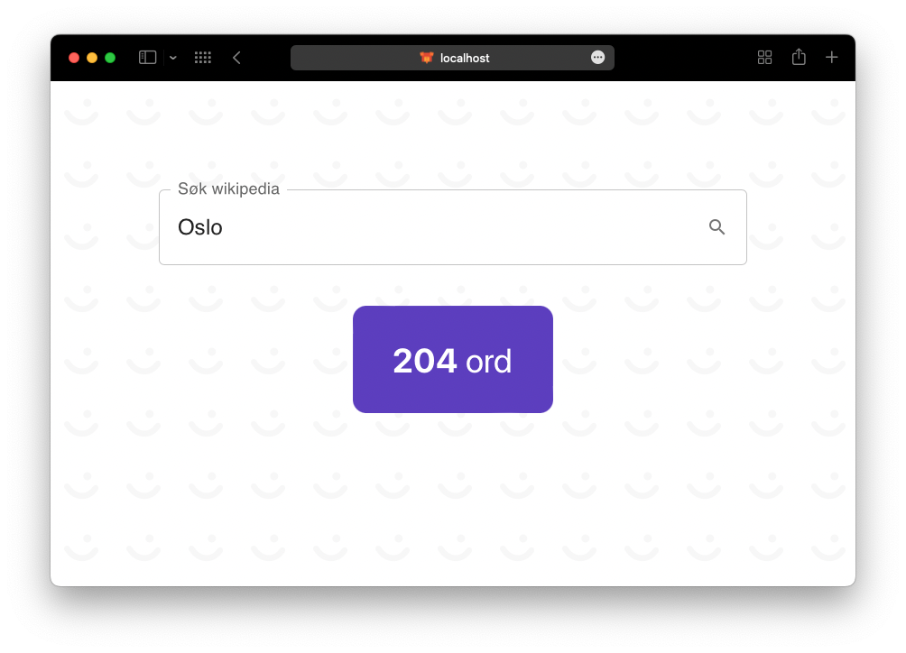

# Vipps-internship case

## Introduction

This project lets a user type in a desired wikipedia-article, and display the occurences of the article-name in the article.

## Project structure

The project is structured as follows:

- frontend: Contains the frontend of the project, which is a simple React-project with TypeScript and Yarn.
- backend: Contains the backend of the project, which is a simple node.js server with express.

The backend supports GET-requests to the endpoint `/article/<name>`, which takes a query-parameter `name` with the name of the article to search for.

## How to run

To run the project, you need to have node.js installed on your computer. Then, you can run the following commands in the terminal:

#### Start the backend:

- `cd backend`
- `npm install`
- `node .`

The backend should now be available at `localhost:8080`.

#### Start the frontend (in another terminal):

- `cd frontend`
- `yarn install` or (npm install)
- `yarn start` or (npm start)

The website should now be available at `localhost:3000`.
